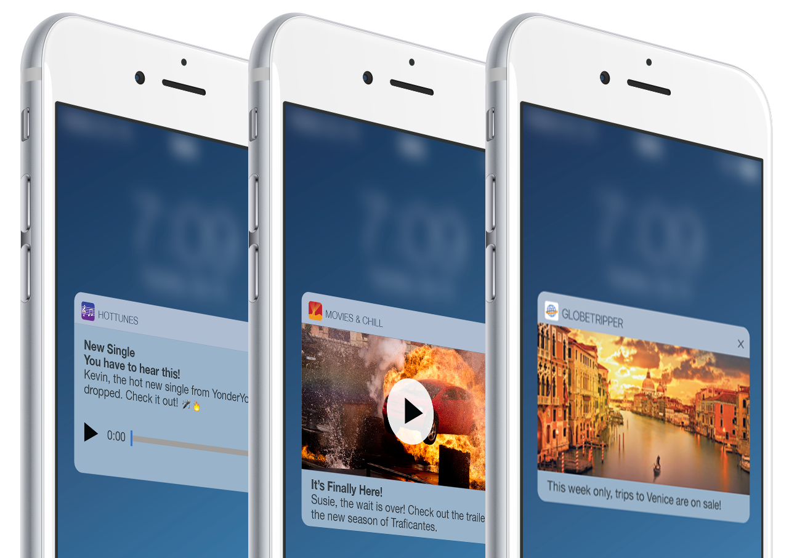
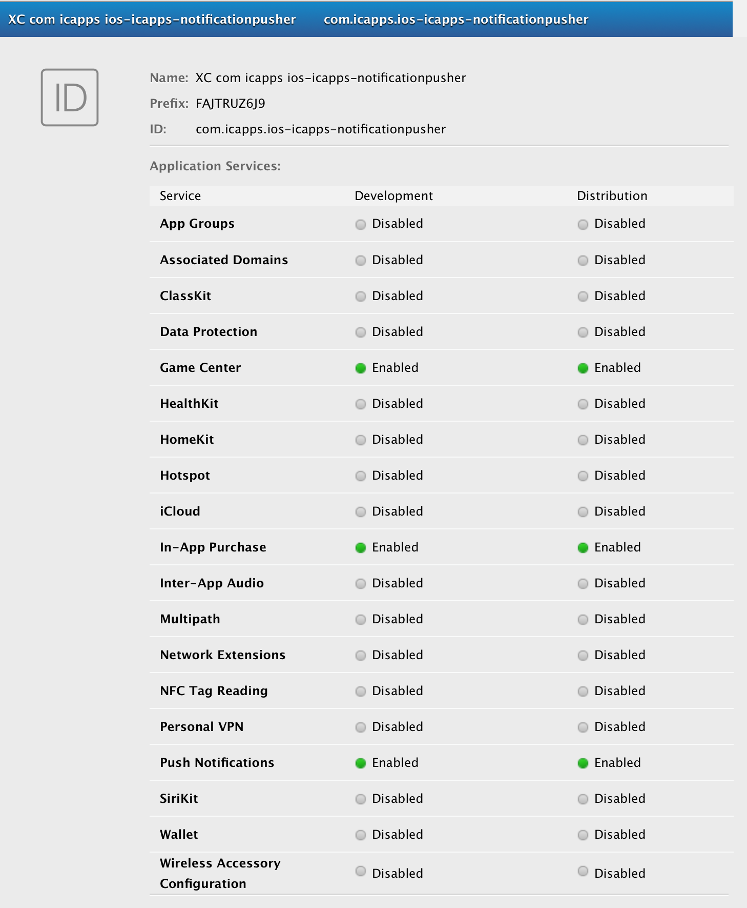
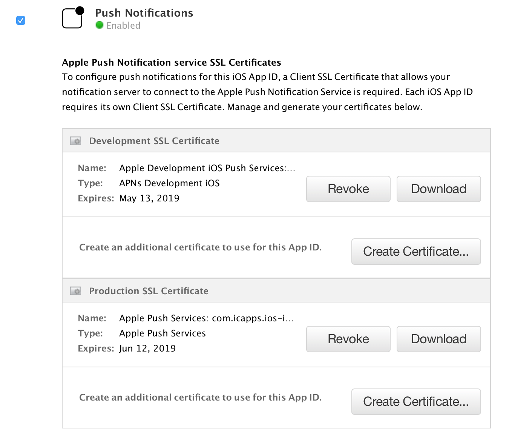
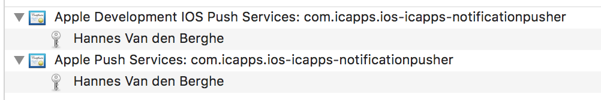
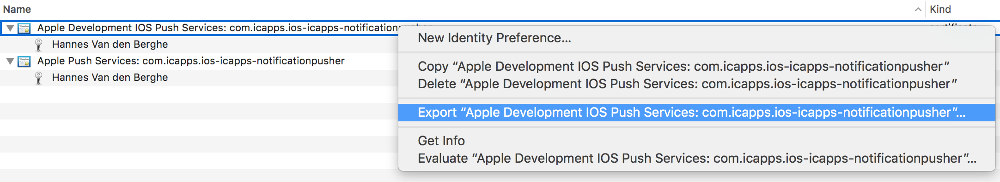
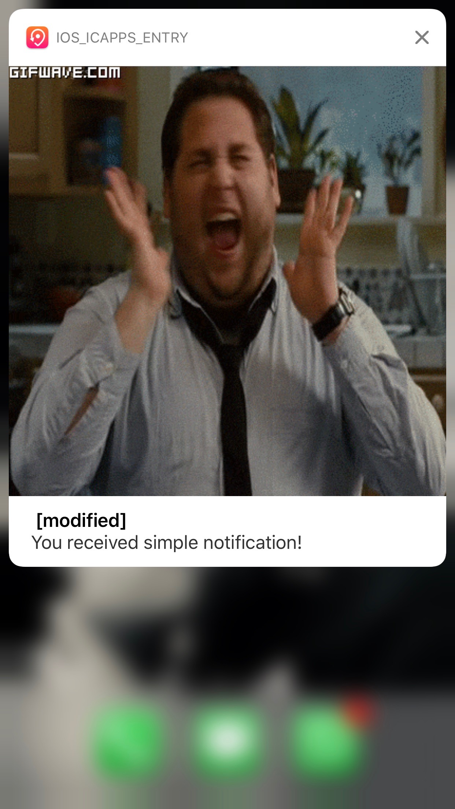

# iOS Tech Gathering Notifications

### Before, the "before we can start"

Since there are some people who didn't get the basics of APN's we'll have a quick recap.

> Apple Push Notification service (APNs) is the centerpiece of the remote notifications feature.
It is a robust, secure, and highly efficient service for app developers to propagate information to iOS (and, indirectly, watchOS), tvOS, and macOS devices.

#### What are Push Notifications

> Local and push notifications are great for keeping users informed with timely and relevant content, whether your app is running in the background or inactive. Notifications can display a message, play a distinctive sound, or update a badge on your app icon.
https://developer.apple.com/notifications/



#### What can Push Notifications do

1. Display a message
2. Play a sound
3. Set a badge icon on your app
4. Provide actions the user can act upon with or without opening the app
5. Show an image or another type of media
6. Be silent but ask the app to perform some action in the background


#### Register for Push Notifications

##### Before registering for push notifications in your application

1. Enable push notifications in your app

  

2. Add SSL Certificates to apple id

  
  * Download the certificates / make sure they are in your KeyChain

3. Export the `.p12` certificate to use in development / production

  

  
  * And send it to the web developers. They will know what to do with this / they should!


##### After registering for push notifications in your application

1. `Capabilities`
  * `Push Notifications`
  * `Background Modes`
    * `info.plist` will be updated to ask with `Required background modes`
2. `AppDelegate.swift`
  * Registering for push notifications
    * What's the good way to do this: https://techcrunch.com/2014/04/04/the-right-way-to-ask-users-for-ios-permissions/
  * Authorization
3. `Provisioning`

#### Code examples

```java
  let notificationTypes: UNAuthorizationOptions = [.alert, .badge, .sound]
        let center = UNUserNotificationCenter.current()

        center.requestAuthorization(options: notificationTypes) { (granted, error) in
            if granted {
                print("Granted")
            } else {
                print("Not granted")
            }
        }

        UIApplication.shared.registerForRemoteNotifications()
```


```java
  func application(_ application: UIApplication, didRegisterForRemoteNotificationsWithDeviceToken deviceToken: Data) {
    // This method is called when registration of notifications succeeded
    // This will be the method were you send the uuid to the backend
 }

 func application(_ application: UIApplication, didReceiveRemoteNotification userInfo: [AnyHashable : Any], fetchCompletionHandler completionHandler: @escaping (UIBackgroundFetchResult) -> Void) {
    // This is the method which is called when the app is opened by the notification
}

func application(_ application: UIApplication, didFailToRegisterForRemoteNotificationsWithError error: Error) {
    // This method is called when registration for notifications failed
}

func userNotificationCenter(_ center: UNUserNotificationCenter,
                         willPresent notification: UNNotification,
               withCompletionHandler completionHandler: @escaping (UNNotificationPresentationOptions) -> Void) {
    // This method is called when a notification arrived when the app was in foreground
}
 ```

 

## Working with Custom notifications

### Before we start

There are some things you should know before we can start to live coding.

* Setup a project with Push notifications
  * Provisioning
  * Authorization

This project is setup with a deployment target of iOS 10. Some of the use cases
explained are only usable in iOS 11 and later.

### Notification Service Extension
> An object that modifies the content of a remote notification before it is delivered to the user.
https://developer.apple.com/documentation/usernotifications/unnotificationserviceextension

1. Create a new extension
  * `Notification Service Extension`
2. Activate the Extension
3. Modify your Push Notification Payload
4. Handle the Payload

#### Used Payload

```json
{
  "aps": {
    "alert": {
      "title": "Happy Jonah Hill",
      "subtitle": "Excited",
      "body": "👏"
    },
    "mutable-content": 1,
    "sound": "default",
    "badge": 0,
    "category": "GIF"
  },
  "url": "https://thumbs.gfycat.com/AggressiveNaiveKillerwhale-size_restricted.gif"
}
```

Not all parameters are needed for this use case. But you have to make sure that.
`mutable-content` is set to `1`.

### Notification Content Extension

>An object that presents a custom interface for a delivered local or remote notification
https://developer.apple.com/documentation/usernotificationsui/unnotificationcontentextension

1. Create a new extension
  * `Notification Content Extension`
2. Activate the extension
3. Modify your Push Notification Payload
4. Modify your `.plist`
  * Edit the `UNNotificationExtensionCategory` to the `category` which was added in your Payload
  * Edit the `UNNotificationExtensionDefaultContentHidden` (optional)

#### Used Payload

```json
{
  "aps": {
    "alert": {
      "title": "Brownies",
      "subtitle": "Delicious",
      "body": "Mmmmh delicious brownies"
    },
    "mutable-content": 1,
    "sound": "default",
    "badge": 0,
    "category": "GROCERY"
  },
  "url": "https://s3-us-west-2.amazonaws.com/notificationvideos/recipe2.mp4"
}
```

### UNNotificationAction

> A task to perform in response to a delivered notification
https://developer.apple.com/documentation/usernotifications/unnotificationaction


### Hidden Notification Content

> Hidden content is new to iOS 11. Users can now go into their settings and turn notification previews off. This means that users only see the text “notification”, as opposed to the substantive notification contents.

### Debug Notification Extensions

1. Run target
2. Select Debug > Attach to process by PID or name
3. Select your extension you want to debug
4. Trigger the notification


### Sources

* Creating Rich Custom UI Notifications: Craig Clayton
  * https://academy.realm.io/posts/try-swift-nyc-2017-craig-clayton-creating-rich-custom-ui-notifications/
* Creating iOS Rich Push Notifications
  * https://www.pluralsight.com/guides/creating-ios-rich-push-notifications
* iOS 10 notifications with attachments and much more
  * https://medium.com/@prianka.kariat/ios-10-notifications-with-attachments-and-much-more-169a7405ddaf
* iOS remote push notifications in a nutshell
  * https://medium.com/flawless-app-stories/ios-remote-push-notifications-in-a-nutshell-d05f5ccac252

### Tools

* NWPusher
  * https://github.com/noodlewerk/NWPusher
* EasyAPNS
  * https://itunes.apple.com/be/app/easy-apns-provider-push-notification-service-testing-tool/id989622350?mt=12
